# 📚 Analisis Data Perpustakaan & Sistem Pendukung Keputusan (DSS)

Selamat datang di proyek Analisis Data Perpustakaan. Proyek ini bertujuan untuk menggali wawasan mendalam dari data transaksi perpustakaan dan menyediakan sistem rekomendasi cerdas untuk pengadaan buku.

---

## 📋 Daftar Isi
1.  [Tentang Proyek](#-tentang-proyek)
2.  [Struktur Dataset](#-struktur-dataset)
3.  [Modul Analisis](#-modul-analisis)
4.  [Metodologi](#-metodologi)
5.  [Hasil & Visualisasi](#-hasil--visualisasi)
6.  [Cara Menjalankan](#-cara-menjalankan)

---

## 📖 Tentang Proyek

Sistem ini dirancang untuk membantu pustakawan dalam mengambil keputusan berbasis data. Dengan menggunakan teknik *Data Mining* dan *Decision Support System* (DSS), kami menjawab pertanyaan krusial seperti:
*   Buku apa yang paling diminati?
*   Buku apa yang sering dipinjam bersamaan? (Pola Asosiasi)
*   Buku mana yang harus segera diganti atau ditambah stoknya?

---

## 🗄️ Struktur Dataset

Dataset ini terdiri dari 8 file CSV yang saling berelasi dengan total ribuan record data. Berikut adalah detail schema dan statistik jumlah data untuk setiap file:

### 1. Data Master (Referensi)

*   **`categorys.csv`** (21 records)
    *   `id`: ID unik kategori.
    *   `name`: Nama kategori (misal: *Fiction*, *Science*, *History*).
    *   `description`: Deskripsi singkat mengenai kategori tersebut.

*   **`students.csv`** (101 records)
    *   `id`: ID unik siswa (Primary Key).
    *   `nis`: Nomor Induk Siswa.
    *   `name`: Nama lengkap siswa.

*   **`book_masters.csv`** (1,001 records)
    *   `id`: ID unik buku (Primary Key).
    *   `title`: Judul lengkap buku.
    *   `author`: Nama penulis.
    *   `publisher`: Nama penerbit.
    *   `year`: Tahun terbit buku.
    *   `categoryId`: ID kategori (Foreign Key ke `categorys.csv`).
    *   `isbn`: Nomor ISBN buku.

*   **`book_items.csv`** (3,001 records)
    *   `id`: ID unik eksemplar buku (Primary Key).
    *   `masterId`: Referensi ke data buku utama (`book_masters`).
    *   `code`: Kode inventaris unik (barcode) untuk setiap eksemplar.
    *   `condition`: Kondisi fisik saat ini (`New`, `Good`, `Fair`, `Poor`).
    *   `status`: Status ketersediaan (`Available`, `Borrowed`, `Lost`, `Maintenance`).
    *   `createdAt`: Tanggal eksemplar didaftarkan ke sistem.

### 2. Data Transaksi

*   **`borrow_transactions.csv`** (1,512 records)
    *   `id`: ID transaksi peminjaman (Primary Key).
    *   `adminId`: ID petugas yang memproses peminjaman.
    *   `studentId`: ID siswa yang meminjam (Foreign Key ke `students.csv`).
    *   `borrowedAt`: Tanggal dan waktu peminjaman.
    *   `dueDate`: Tanggal jatuh tempo pengembalian.
    *   `status`: Status transaksi (`Borrowed`, `Returned`, `Overdue`).

*   **`borrow_details.csv`** (3,001 records)
    *   `id`: ID detail peminjaman.
    *   `borrowId`: ID transaksi peminjaman (Foreign Key ke `borrow_transactions.csv`).
    *   `bookItemId`: ID eksemplar buku yang dipinjam (Foreign Key ke `book_items.csv`).
    *   `conditionAtBorrow`: Kondisi fisik buku saat dipinjam.

*   **`return_transactions.csv`** (1,501 records)
    *   `id`: ID transaksi pengembalian.
    *   `borrowId`: ID transaksi peminjaman yang dikembalikan (Foreign Key ke `borrow_transactions.csv`).
    *   `adminId`: ID petugas yang menerima pengembalian.
    *   `returnedAt`: Tanggal dan waktu pengembalian.

*   **`return_details.csv`** (2,982 records)
    *   `id`: ID detail pengembalian.
    *   `returnId`: ID transaksi pengembalian (Foreign Key ke `return_transactions.csv`).
    *   `bookItemId`: ID eksemplar buku yang dikembalikan.
    *   `conditionAtReturn`: Kondisi fisik buku saat dikembalikan (Validasi perubahan kondisi).
    *   `notes`: Catatan tambahan mengenai pengembalian (kerusakan, denda, dll).

---

## 🔍 Modul Analisis

Proyek ini terdiri dari beberapa skrip Python yang masing-masing memiliki fokus analisis spesifik:

| Script | Deskripsi & Tujuan |
| :--- | :--- |
| **`analyze_book_popularity.py`** | **Analisis Popularitas**: Mengklasifikasikan buku ke dalam label **HOT** (Sangat Populer), **MODERATE**, **LOW**, dan **FLOP** berdasarkan frekuensi peminjaman. |
| **`analyze_top_books.py`** | **Top Charts**: Menghasilkan daftar 10 buku dengan jumlah peminjaman tertinggi sepanjang masa. |
| **`analyze_book_association.py`** | **Market Basket Analysis (Buku)**: Menemukan pola peminjaman antar buku. Contoh: *"Jika meminjam Buku A, 70% kemungkinan juga meminjam Buku B"*. |
| **`analyze_category_association.py`** | **Market Basket Analysis (Kategori)**: Menganalisis hubungan antar genre. Berguna untuk memahami preferensi lintas topik anggota perpustakaan. |
| **`dss_recommendation.py`** | **Sistem Rekomendasi (DSS)**: Memberikan saran aksi (Ganti/Beli Baru) berdasarkan kondisi fisik buku dan tingkat permintaannya. |

---

## 🧠 Metodologi

### 1. Klasifikasi Popularitas Buku
Kami menggunakan kombinasi **usia buku** dan **frekuensi peminjaman** untuk mengkategorikan buku.

**Langkah-langkah:**
1.  **Hitung Kuantil Peminjaman**:
    *   *Low Demand*: Peminjaman <= Persentil 33%
    *   *High Demand*: Peminjaman > Persentil 66%
    *   *Average Demand*: Di antara keduanya.
2.  **Tentukan Usia Buku**:
    *   *New*: Terbit dalam 3 tahun terakhir.
    *   *Old*: Terbit lebih dari 3 tahun lalu.
3.  **Matriks Kategori**:

| Kategori | Usia Buku | Permintaan (Demand) | Deskripsi |
| :--- | :--- | :--- | :--- |
| **HOT** | New | High | Buku baru yang langsung populer. |
| **FLOP** | New | Low | Buku baru yang gagal menarik minat. |
| **EVERGREEN** | Old | High | Buku lama yang tetap diminati sepanjang masa. |
| **DEAD STOCK**| Old | Low | Buku lama yang sudah tidak diminati. |
| **AVERAGE** | Any | Average | Buku dengan performa standar. |

### 2. Association Rule Mining (Pola Asosiasi)
Kami menggunakan pendekatan *Market Basket Analysis* yang diperluas untuk menemukan hubungan antar item dengan alur **Apriori-like**:

1.  **Itemset Generation**:
    *   **1-Itemset**: Frekuensi item tunggal.
    *   **2-Itemset**: Kombinasi sepasang item.
    *   **3-Itemset**: Kombinasi tiga item (Triple Association).
2.  **Frequent Itemset Filtering**: Hanya kombinasi yang memenuhi `MIN_SUPPORT` yang diproses lanjut.
3.  **Rule Generation**: Membentuk aturan sebab-akibat dari frequent itemsets.

**Metrik:**
*   **Support**: Seberapa populer suatu kombinasi item.
*   **Confidence**: Seberapa kuat hubungan sebab-akibat (Jika A maka B).
*   **Lift**: Rasio ketergantungan. Nilai `Lift > 1` menunjukkan hubungan yang signifikan.

### 3. Analisis Ukuran Transaksi
Menganalisis perilaku peminjaman siswa berdasarkan jumlah buku yang dipinjam dalam satu waktu (Single, Double, atau Triple books).

### 4. Book Clustering Analysis
Kami menggunakan algoritma **K-Means Clustering** untuk mengelompokkan buku berdasarkan kemiripan pola karakteristik.

**Fitur yang digunakan:**
*   **Borrow Frequency**: Tingkat popularitas peminjaman.
*   **Publication Year**: Tahun terbit buku.
*   **Category**: Genre buku.

Tujuannya adalah untuk mengidentifikasi segmen buku seperti "Buku Klasik Populer", "Buku Baru Niche", dll.

### 5. Weighted Scoring Model (DSS)
Untuk rekomendasi pengadaan buku, kami menggunakan model pembobotan sederhana namun efektif.

**Rumus Dasar:**
$$ Score = \sum_{i=1}^{n} (x_i \times w_i) $$

Setiap buku dinilai dengan rumus spesifik proyek:

$$ \text{Score} = (1.0 \times \text{BorrowCount}) + (10.0 \times \text{PoorCopies}) + (2.0 \times \text{FairCopies}) $$

**Penjelasan Bobot:**
*   **Kondisi Buruk (10.0)**: Prioritas tertinggi. Buku yang rusak (`Poor`) harus segera diganti untuk menjaga kualitas layanan.
*   **Kondisi Sedang (2.0)**: Prioritas menengah. Buku kondisi `Fair` perlu dipantau.
*   **Popularitas (1.0)**: Faktor pendukung. Buku yang rusak DAN populer akan mendapatkan skor sangat tinggi, menjadikannya prioritas utama pengadaan.

---

## 📊 Hasil & Visualisasi

Berikut adalah ringkasan visual dari hasil analisis data perpustakaan.

### 🏆 1. Buku Terlaris (Top 10)
Daftar buku yang menjadi favorit pemustaka.
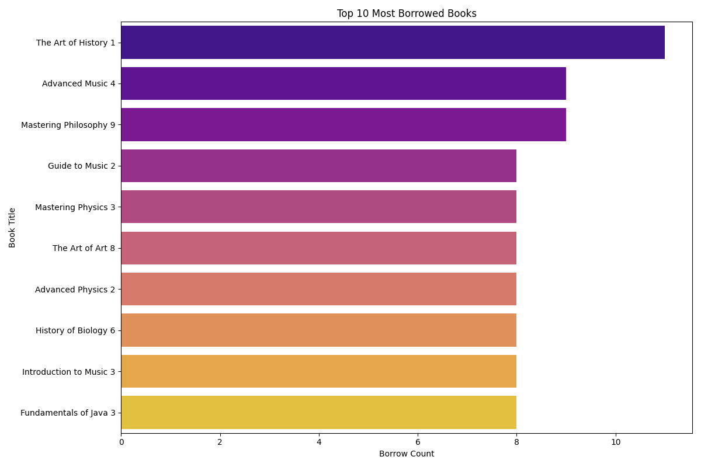

### 📈 2. Distribusi Status Buku
Gambaran umum koleksi perpustakaan berdasarkan tingkat aktivitasnya.
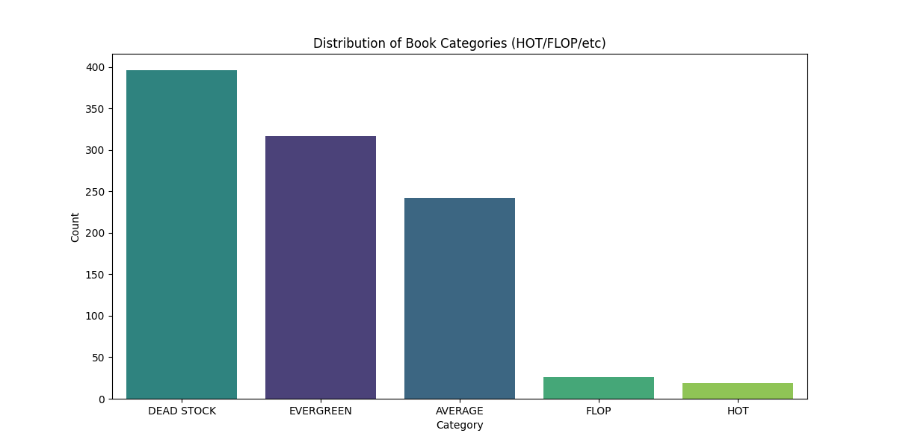

### 📚 3. Popularitas Kategori
Genre buku yang paling banyak dicari.
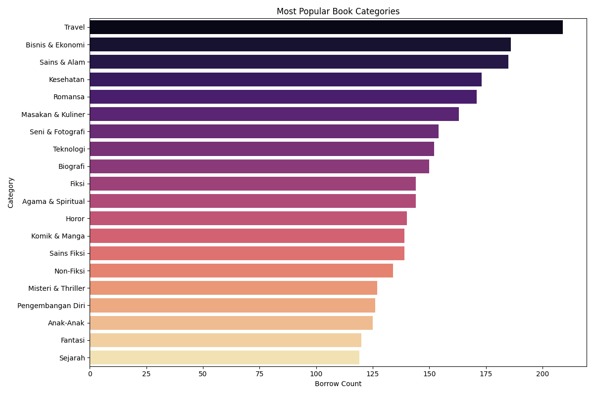

### 🕸️ 4. Jaringan Asosiasi (Buku & Kategori)
Visualisasi graf yang menunjukkan keterhubungan antar buku dan antar kategori. Ketebalan garis menunjukkan kekuatan hubungan (*Lift*).

**Asosiasi Buku:**
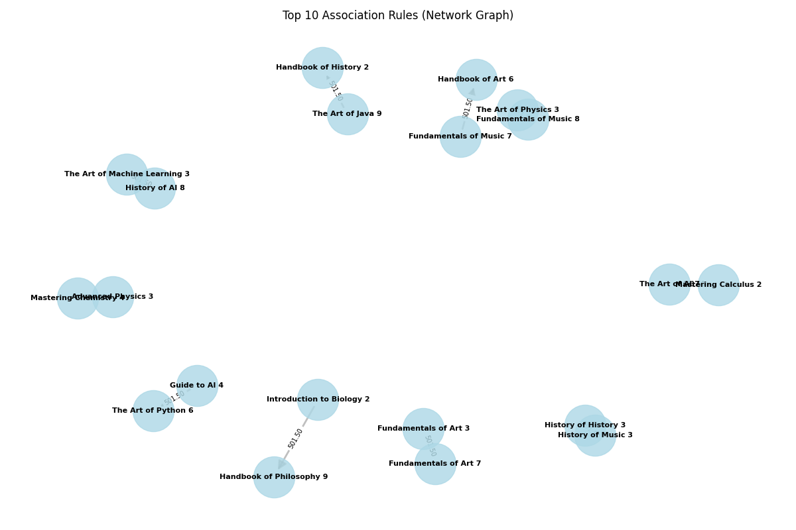

**Asosiasi Kategori:**
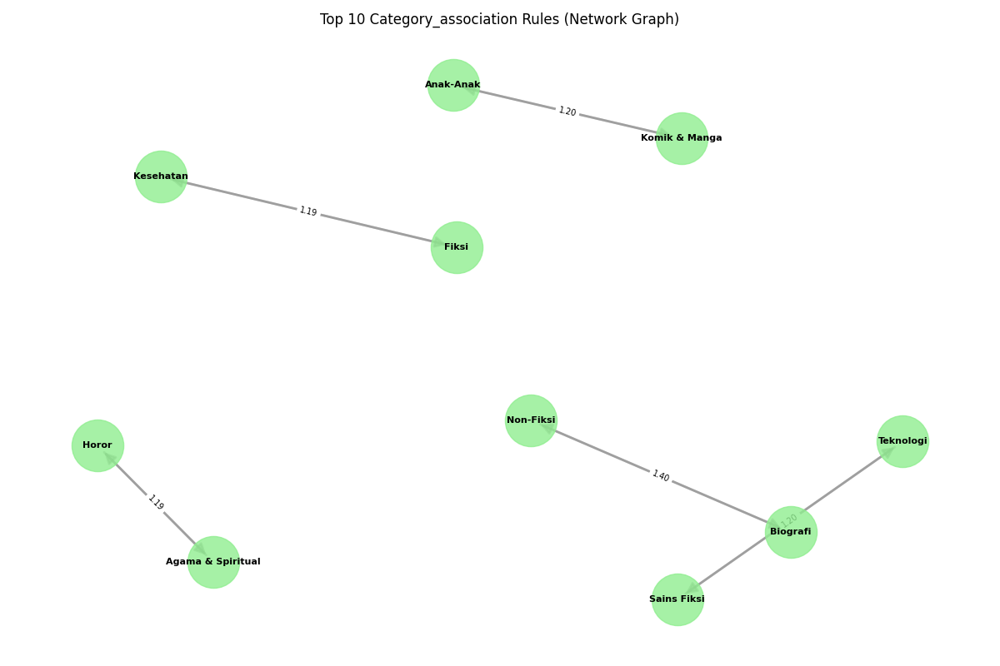

### 5. Frequent Itemsets (Top Kombinasi)
Grafik ini menampilkan kombinasi item (buku/kategori) yang paling sering muncul dalam transaksi.

**A. Analisis Buku:**
*   **Top 1-Itemset (Buku Tunggal):**
    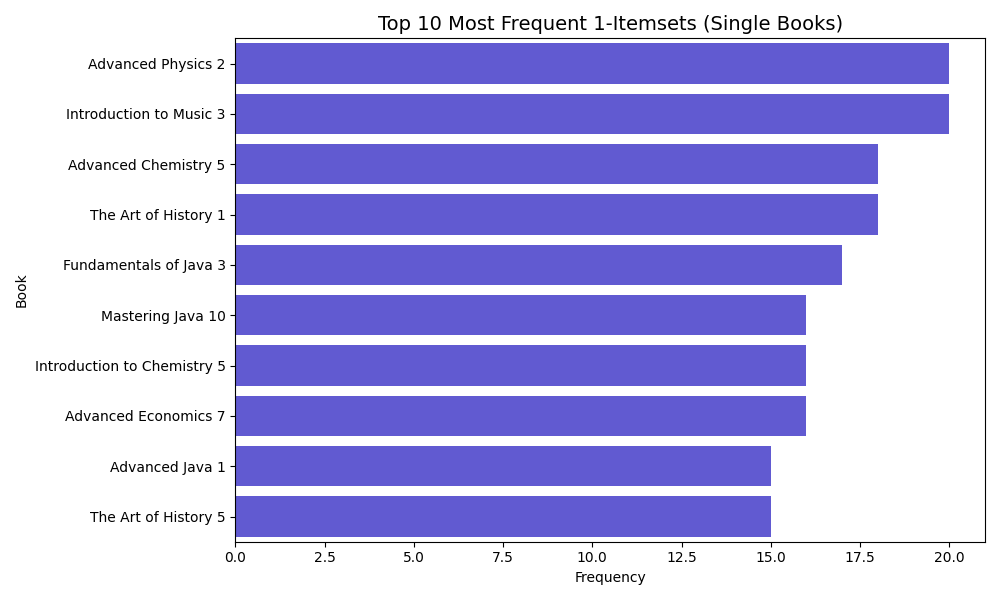
*   **Top 2-Itemset (Pasangan Buku):**
    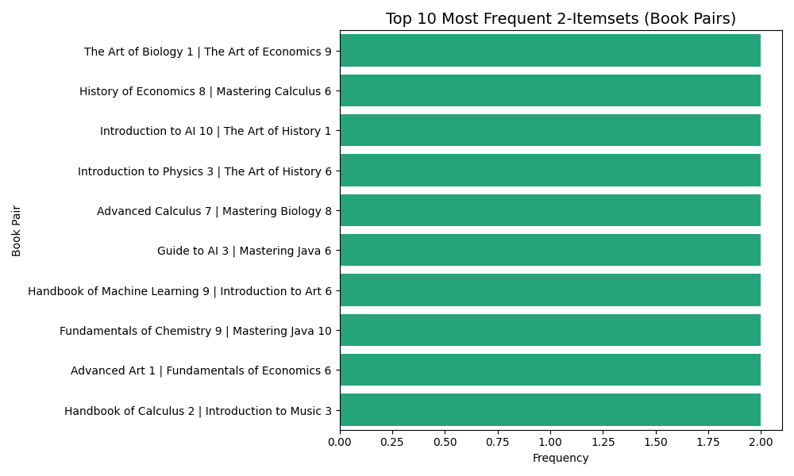
*   **Top 3-Itemset (Tiga Buku):**
    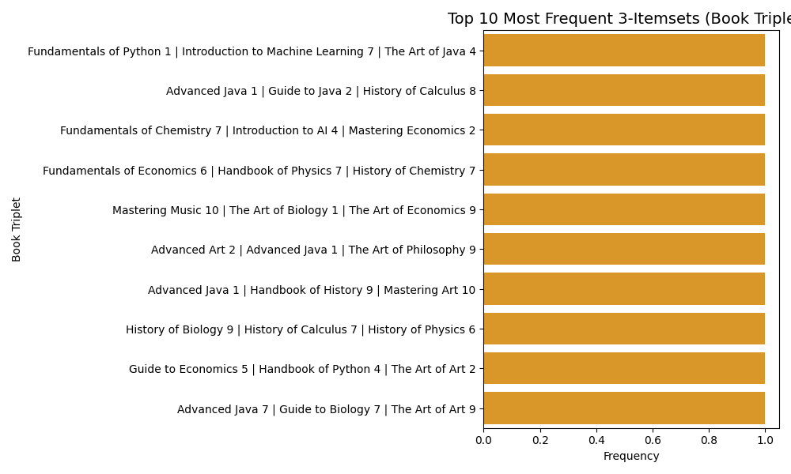

**B. Analisis Kategori:**
*   **Top 1-Itemset (Kategori Tunggal):**
    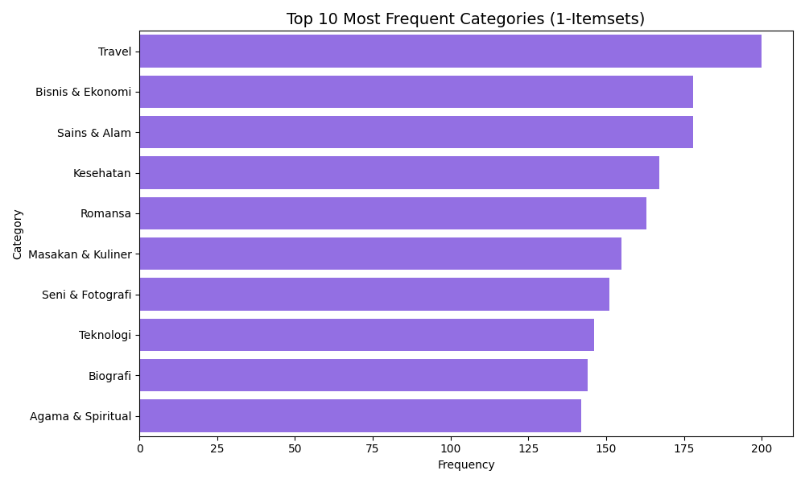
*   **Top 2-Itemset (Pasangan Kategori):**
    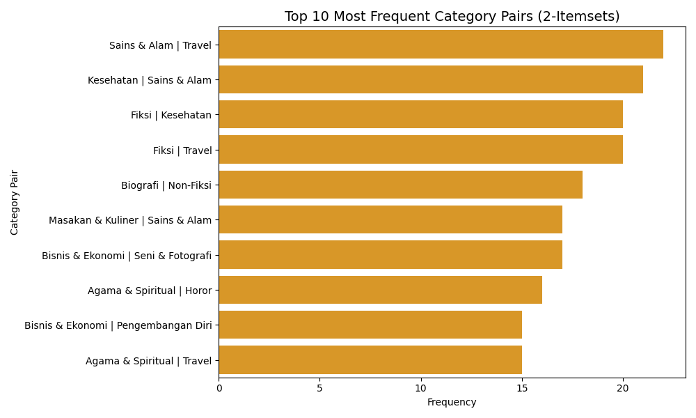
*   **Top 3-Itemset (Tiga Kategori):**
    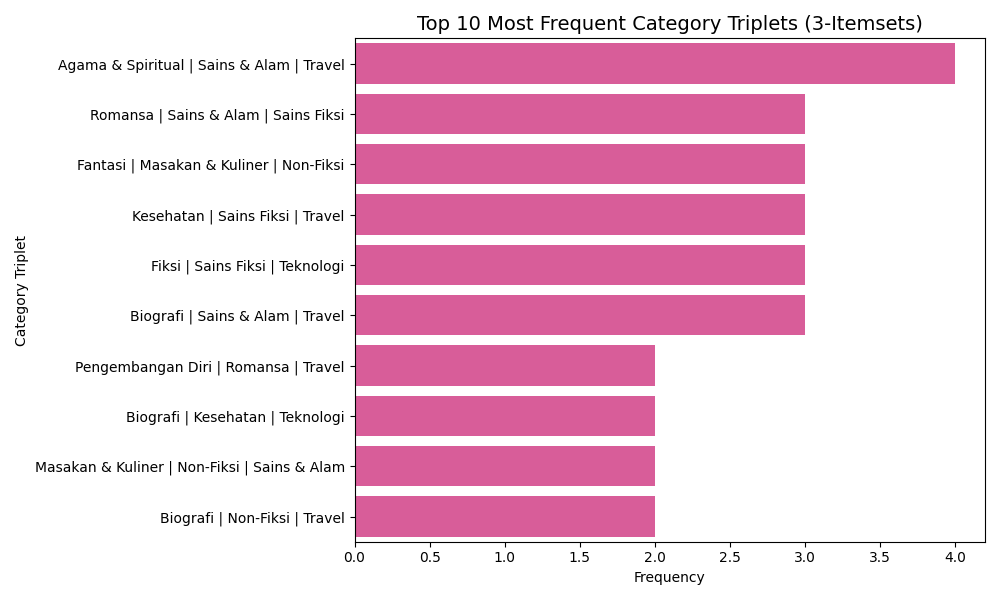

### 6. Rekomendasi Pembelian (DSS)
Daftar prioritas pengadaan buku. Grafik ini menyoroti buku-buku yang paling mendesak untuk dibeli kembali.
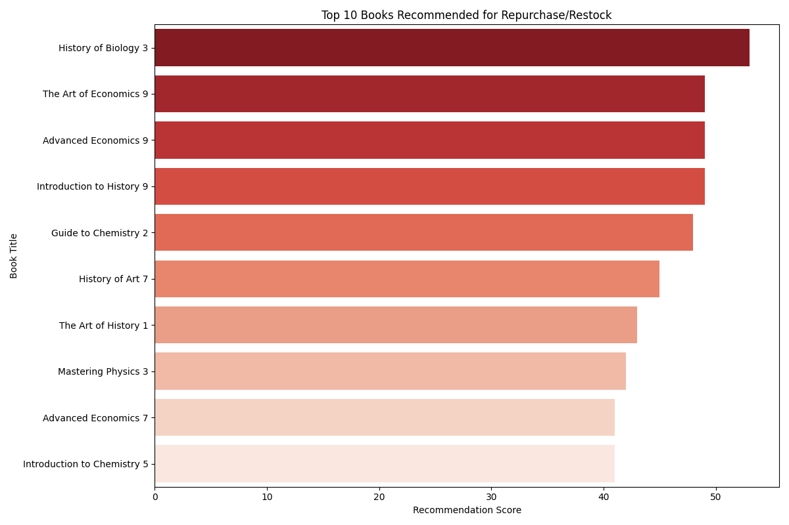

### 7. Hasil Clustering Buku
Pengelompokan buku berdasarkan frekuensi dan metadata.
*   **Scatter Plot (Tahun vs Frekuensi):**
    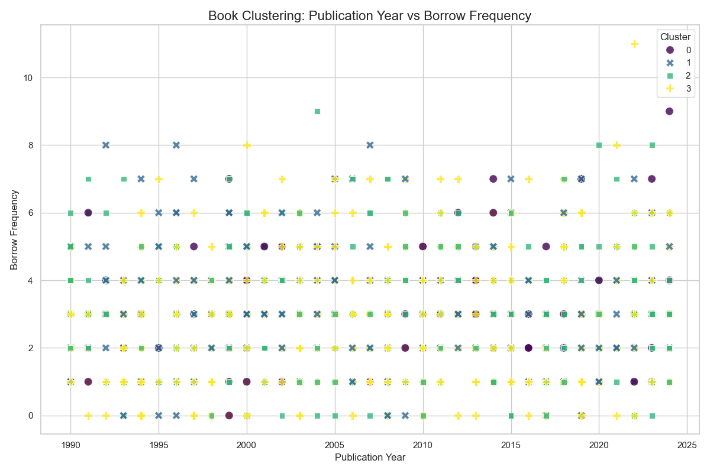
*   **Distribusi Peminjaman per Cluster:**
    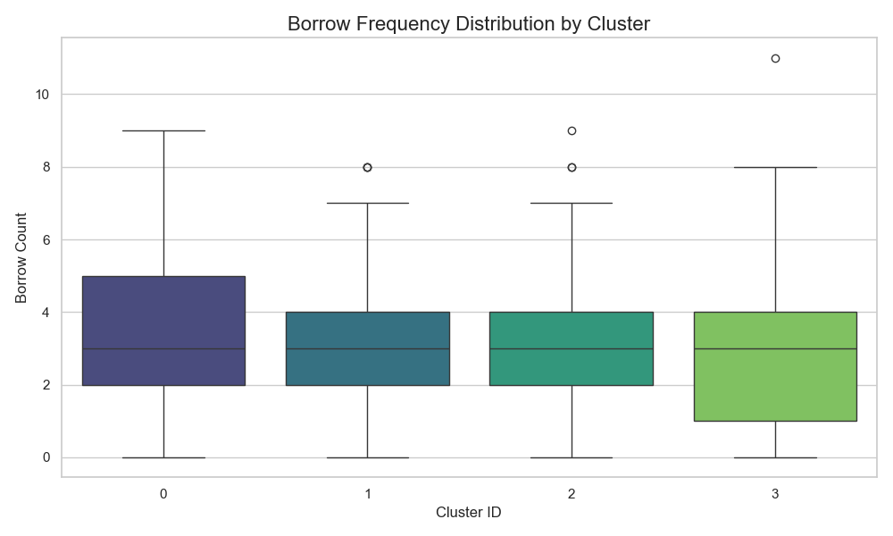

---

## 🚀 Cara Menjalankan

Pastikan Anda telah menginstal Python dan library yang dibutuhkan (`pandas`, `matplotlib`, `seaborn`, `networkx`, `scikit-learn`).

1.  **Jalankan Analisis**:
    ```bash
    python analysis/analyze_book_popularity.py
    python analysis/analyze_top_books.py
    python analysis/analyze_book_association.py
    python analysis/analyze_category_popularity.py
    python analysis/analyze_category_association.py
    python analysis/dss_recommendation.py
    python analysis/analyze_book_clustering.py
    ```

2.  **Generate Visualisasi**:
    ```bash
    python analysis/visualize_results.py
    python analysis/visualize_itemsets.py
    python analysis/visualize_category_itemsets.py
    python analysis/analyze_transaction_size.py
    ```

3.  **Lihat Hasil**:
    *   Data CSV: `analysis/output/`
    *   Gambar Grafik: `analysis/visualizations/`
        *   `top_3_itemsets.png`: Frekuensi kombinasi 3 buku.
        *   `top_3_category_itemsets.png`: Frekuensi kombinasi 3 kategori.
        *   `transaction_size_distribution.png`: Distribusi jumlah buku per transaksi.
        *   `book_clustering_scatter.png`: Visualisasi cluster buku.

---
*Dikembangkan untuk Proyek DSS Perpustakaan*
